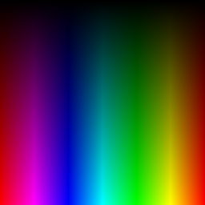
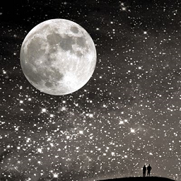
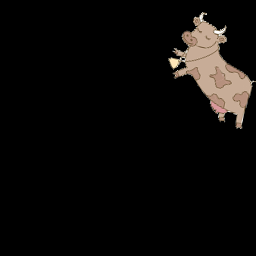
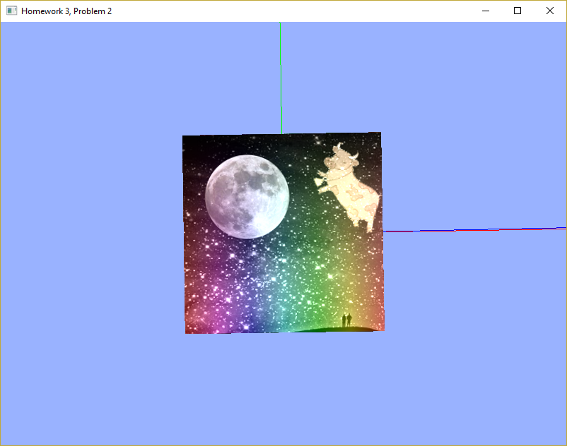
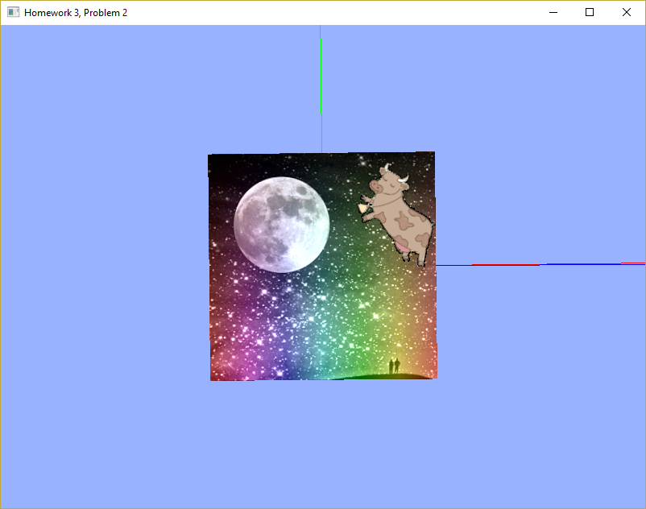

# Homework 3

### Deliverables for Problem 2

The following images were combined:

[gradient.bmp](./gradient.bmp):<br />
<br />

[moon.bmp](./moon.bmp):<br />
<br />

[cow.bmp](./cow.bmp):<br />


<hr />

Texture blending method 1: [result1.png](./result1.png):
 <br />
  This image resulted from a very simple combination of the three textures:

  ```c++
  vec4 gradientTexColor = texture(gradient_tex, pass_TexCoord);
  vec4 moonTexColor = texture(moon_tex, pass_TexCoord);
  vec4 cowTexColor = texture(cow_tex, pass_TexCoord);

  color = (gradientTexColor * .4) + moonTexColor + cowTexColor;
  ```

Texture blending method 1: [results2.png](./result2.png):
  <br />
  This image resulted from a slightly more intelligent combination which ignored the cow image color if the color was black and exclusively used the cow image color if the color was non-black:

  ```c++
  vec4 gradientTexColor = texture(gradient_tex, pass_TexCoord);
  vec4 moonTexColor = texture(moon_tex, pass_TexCoord);
  vec4 cowTexColor = texture(cow_tex, pass_TexCoord);

  if (cowTexColor.x != 0) {
	  color = cowTexColor;
  } else {
	  color = (gradientTexColor * .4) + moonTexColor;
  }
  ```